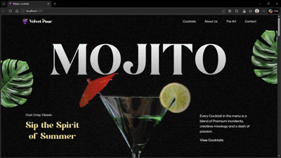

# 🍹 Mojito Cocktails

A modern and interactive cocktail website showcasing different Mojito recipes with a clean UI and smooth user experience.

🌐 **Live Demo:**  
👉 https://mojito-cocktails-nu-silk.vercel.app/

---

## 🎥 Project Preview



> *(If the video does not autoplay on GitHub, download and view it locally)*
👉 *https://github.com/ahatwar822/Mojito-Cocktails/blob/1329a9c6dba5756768ce793ea3654fefe4e685e2/public/videos/Mojito_Cocktails.mp4*

---


## <a name="quick-start"> Quick Start</a>

Follow these steps to set up the project locally on your machine.

**Prerequisites**

Make sure you have the following installed on your machine:

- [Git](https://git-scm.com/)
- [Node.js](https://nodejs.org/en)
- [npm](https://www.npmjs.com/) (Node Package Manager)

**Cloning the Repository**

```bash
git clone https://github.com/ahatwar822/Mojito-Cocktails.git
cd Mojito-Cocktails
```

**Installation**

Install the project dependencies using npm:

```bash
npm install
```

**Running the Project**

```bash
npm run dev
```

Open [http://localhost:5173](http://localhost:5173) in your browser to view the project.